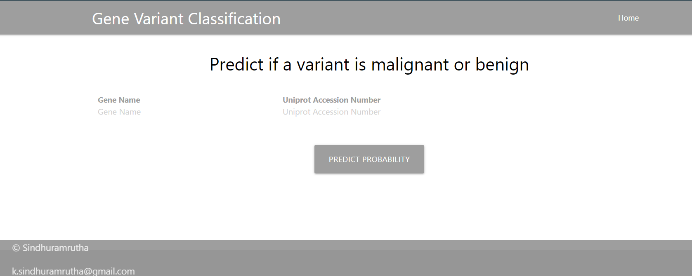

### Motto:
A machine learning model using Decision Trees to classify whether a given gene variant is benign/ malignant or of uncertain significance.
The user is asked to provide the name of their gene in which the variant is present along with the kind of variant present (in accordance with the UniProt nomenclature)
and the algorithm classifies it accordingly.

### Data Source:
The data taken here is the humsavar.txt data from the UniProt Knowledge Base: https://ftp.uniprot.org/pub/databases/uniprot/current_release/knowledgebase/complete/docs/humsavar
The csv file is provided as well.

The application gets its data through the DataConnect API by the GA4GH Discovery Work Stream.
More about DataConnect API can be read here: https://ga4gh-discovery.github.io/data-connect/

Details on running the DataConnect API Instance are explained here: https://github.com/DNAstack/fasp-hackathon-2022

### Running the Application
1. Clone the repo and go to the folder in bash/ cmd.
2. Install the requirents.txt.
3. Run the Python Application.
python app.py
4. The application is also hosted as a Heroku App here: https://gene-variant-monitoring.herokuapp.com/

### Further Ahead
Here, the data is used for classifying the gene and not identifying it's association with disease. The data source and similar ones could also be used comprehensively to understand the relation between various gene variants, diseases and their epidemiology.

